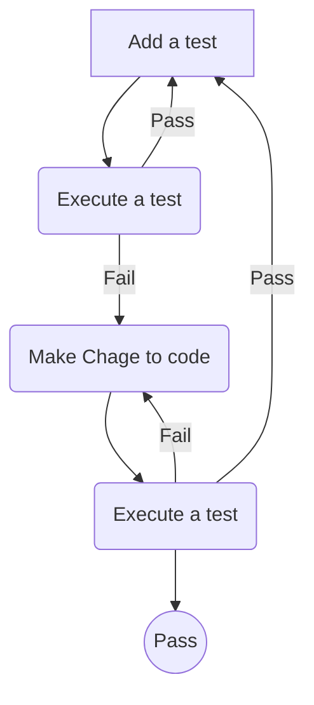

## Test Driven Development with Typescript Express Nodejs Mocha

- create `.env` file in root folder
   ```
   PORT=3000
   ```

```
> npm install --save express dotenv
> npm install -D mocha chai typescript nodemon supertest ts-node tsconfig-paths
> npm install -D @types/express @types/mocha @types/chai @types/node @types/supertest
> npm install typeorm --save
> npm install bcryptjs jsonwebtoken
> npm install --save-dev @types/bcryptjs @types/jsonwebtoken
> npm install amqplib
> npm install @types/amqplib
> npm install pg --save
```

```
tsc --init
npm test -- -w
```

- change `package.json` file from 
```
"dev": "set NODE_ENV=dev & nodemon -r tsconfig-paths/register src/app.ts",
"test": "set NODE_ENV=test & mocha --check-leaks -r tsconfig-paths/register -r ts-node/register \"test/**/*.spec.ts\""
```
## TO below setting for mac
```
"dev": "NODE_ENV=dev nodemon -r tsconfig-paths/register src/app.ts",
"test": "NODE_ENV=test mocha --check-leaks -r tsconfig-paths/register -r ts-node/register \"test/**/*.spec.ts\""
```

TDD Approach
```
- write test first
- execute a test 
- write code to pass the test
```



helpers -> reusable function

- STATUS CODE
   ```
   200 => OK -> GET PUT PATCH
   201 => CREATED -> POST
   202 => ACCEPTED
   203 => NON AUTHORITATIVE INFORMATION
   204 => NO CONTENT -> DELETE
   205 => RESET CONTENT
   206 => PARTIAL CONTENT

   301 => MOVED PERMANENTLY
   304 => NOT MODIFIED
   305 => USE PROXY
   306 => RESERED
   307 => TEMPORARY REDIRECT
   308 => PERMANENT REDIRECT

   400 => BAD REQUEST
   401 => UNAUTHORIZED
   402 => PAYMENT REQUIRED
   403 => FORBIDDEN
   404 => PAGE NOT FOUND
   405 => METHOD NOT ALLOWED
   406 => NOT ACCEPTABLE
   407 => PROXY AUTHENTICATION REQUIRED
   408 => REQUEST TIMEOUT
   409 => CONFLICT
   410 => GONE
   411 => LENGTH REQUIRED
   415 => UNSUPPORTED MEDIA TYPE

   500 => INTERNAL SERVER ERROR
   501 => NOT IMPLEMENTED
   502 => BAD GETWAY
   503 => SERVICE UNAVAILABLE
   504 => GATEWAY TIMEOUT
   505 => HTTP VERSION NOT SUPPORTED
   506 => VARIANT ALSO NEGOTIATES
   507 => INSUFFICIENT_STORAGE
   508 => LOOP_DETECTED
   509 => BANDWIDTH LIMIT EXCEEDED
   510 => NOT_EXTENDED
   511 => NETWORK AUTHENTICATION REQUIRED
   ```


   ```
   if (req.query.s) {
      options = {
         ...options,
         where: {
         $or: [
            { title: new RegExp(req.query.s.toString(), 'i') },
            { subTitle: new RegExp(req.query.s.toString(), 'i') },
         ]
         }
      }
   }

   if (req.query.sort) {
      options = {
         ...options,
         order: {
         price: req.query.sort.toString().toUpperCase()
         }
      }
   }
   ```