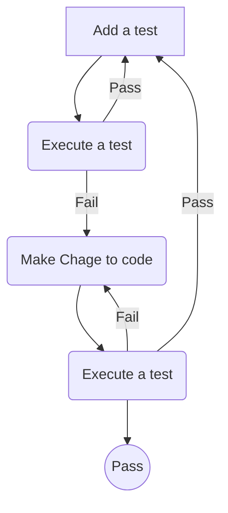

## Test Driven Development with Typescript Express Nodejs Mocha

- create `.env` file in root folder
   ```
   PORT=3000
   ```

```
> npm install --save express dotenv
> npm install -D mocha chai typescript nodemon supertest ts-node tsconfig-paths
> npm install -D @types/express @types/mocha @types/chai @types/node @types/supertest
> npm install typeorm --save
> npm install bcryptjs jsonwebtoken
> npm install --save-dev @types/bcryptjs @types/jsonwebtoken
```

```
tsc --init
npm test -- -w
```

- change `package.json` file from 
```
"dev": "set NODE_ENV=dev & nodemon -r tsconfig-paths/register src/app.ts",
"test": "set NODE_ENV=test & mocha --check-leaks -r tsconfig-paths/register -r ts-node/register \"test/**/*.spec.ts\""
```
## TO below setting for mac
```
"dev": "NODE_ENV=dev nodemon -r tsconfig-paths/register src/app.ts",
"test": "NODE_ENV=test mocha --check-leaks -r tsconfig-paths/register -r ts-node/register \"test/**/*.spec.ts\""
```

TDD Approach
```
- write test first
- execute a test 
- write code to pass the test
```



- STATUS code
   ```
   200 OK -> GET PUT PATCH
   201 CREATED -> POST
   204 NO CONTENT -> DELETE
   302 MOVED PERMANENT
   400 BAD REQUEST
   401 UNAUTHORIZED
   403 FORBIDDEN
   404 PAGE NOT FOUND
   405 METHOD NOT ALLOWED
   406 NOT ACCEPTABLE
   408 REQUEST TIMEOUT
   500 INTERNAL SERVER ERROR
   501 NOT IMPLEMENTED
   502 BAD GETWAY
   503 SERVICE UNAVAILABLE
   504 GATEWAY TIMEOUT
   505 HTTP VERSION NOT SUPPORTED`
   ```