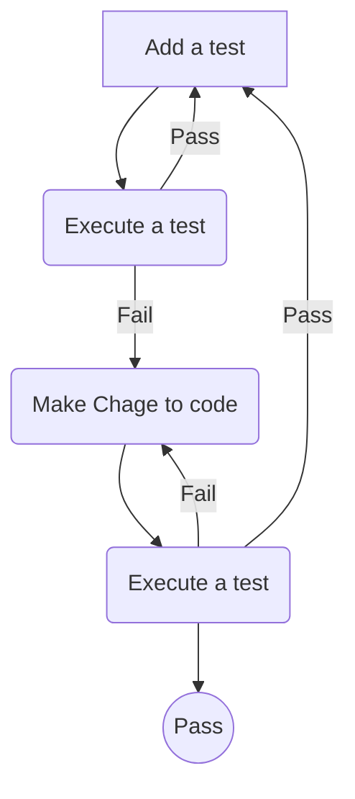

## Test Driven Development with Typescript Express Nodejs Mocha


```
> npm install --save express dotenv
> npm install -D mocha chai typescript nodemon supertest ts-node tsconfig-paths
> npm install -D @types/express @types/mocha @types/chai @types/node @types/supertest
> npm install typeorm --save
```


```
tsc --init
npm test -- -w
```
write test first 
wirte code to pass the test





STATUS code
200 OK
201 CREATED
204 NO CONTENT
302 MOVED PERMANENT
401 UNAUTHORIZED
403 FORBIDDEN
404 PAGE NOT FOUND
405 METHOD NOT ALLOWED
406 NOT ACCEPTABLE
408 REQUEST TIMEOUT
500 INTERNAL SERVER ERROR
501 NOT IMPLEMENTED
502 BAD GETWAY
503 SERVICE UNAVAILABLE
504 GATEWAY TIMEOUT
505 HTTP VERSION NOT SUPPORTED
