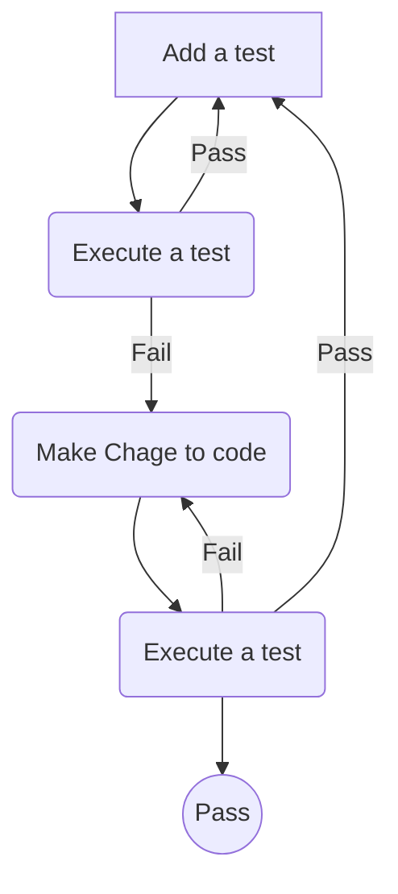

## Test Driven Development with Typescript Express Nodejs Mocha


```
> npm install --save express dotenv
> npm install -D mocha chai typescript nodemon supertest ts-node tsconfig-paths
> npm install -D @types/express @types/mocha @types/chai @types/node @types/supertest
> npm install typeorm --save
```


```
tsc --init
```
write test first 
wirte code to pass the test


